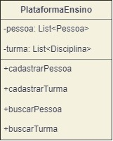

<h4><b>Nome:</b> Icaro Dell Osso Vaz de Carvalho <b>RA:</b> 1460482121031</h4>

<h2>Ciclo de Vida do Desenvolvimento de Software (Plataforma de Ensino)</h2>

<h3>Atividade de Requisitos </h2>

<h3>:mag_right: Coletar os requisitos funcionais e não-funcionais do sistema</h3>

<h4>
:pushpin: Requisitos funcionais: são tarefas ou ações do sistema.
 

:pushpin: Requisitos não-funcionais: são qualidades do sistema.</h4>

• Os requisitos funcionais são de extrema importância no desenvolvimento de software, pois sem eles não há funcionalidades nos sistemas. Seus modelos devem ser construídos em um nível de entendimento claro e objetivo, além de um código fonte totalmente aplicável. 
Como um requisito funcional específico, foi desenvolvido um Diagrama de Casos de Uso [:computer_mouse:](https://github.com/Mikkenz/Bertoti/blob/main/Engenharia%20de%20Software%20I/requisitosFuncionais.png)
  
• Uma vez que os requisitos funcionais definem o que o sistema fará, a Engenharia de Software afirma que os requisitos não-funcionais definem <i><b>como</i></b> o sistema fará, embora não seja tão claro assim essa definição. Os requisitos não-funcionais não estão relacionados diretamente às funcionalidades de um sistema.
Dentro dos requisitos não-funcionais, foi desenvolvido uma interface de simples acesso e uso às funções do sistema (Usabilidade) [:computer_mouse:](https://github.com/Mikkenz/Bertoti/blob/main/Engenharia%20de%20Software%20I/requisitosNaoFuncionais.png)

<h4>
<b>:dart: Objetivo da Atividade:</b> Transformar os requisitos (tanto funcionais quanto não-funcionais) em algo que possa ser implementado.</h4>

:pushpin: Projeto Classes:
  
  

<h3>Projeto :construction_worker_woman:</h2>

  ## 💻Desenvolvimento
  

Nessa etapa foi usada a linguagem Java para codificar cada uma das classes criadas na etapa anterior.

  

  
  

 

    public class Pessoa {

    private String nome;
    private String matricula;
    private String tipo;

    public Pessoa(String nome, String matricula, String tipo) {
        this.nome = nome;
        this.matricula = matricula;
        this.tipo = tipo;
    }
    public String getNome() {
        return nome;
    }

    public void setNome(String nome) {
        this.nome = nome;
    }

    public String getMatricula() {
        return matricula;
    }

    public void setMatricula(String matricula) {
        this.matricula = matricula;
    }

    public String getTipo() {
        return tipo;
    }

    public void setTipo(String tipo) {
        this.tipo = tipo;
    }
  }

 

  
  

 

     public class Disciplina {

    private String nome;
    private String docente;

    public Disciplina(String nome, String docente) {
        this.nome = nome;
        this.docente = docente;
    }

    public String getNome() {
        return nome;
    }

    public void setNome(String nome) {
        this.nome = nome;
    }

    public String getDocente() {
        return docente;
    }

    public void setDocente(String docente) {
        this.docente = docente;
    }
}

 

  
  

 

    import java.util.LinkedList;
import java.util.List;

public class Plataforma {

    private List<Pessoa> pessoas = new LinkedList<Pessoa>();
    private List<Disciplina> disciplinas = new LinkedList<Disciplina>();

    public void cadastrarPessoa(Pessoa pessoa){
        pessoas.add(pessoa);
    }

    public Pessoa buscarPessoaNome(String nome){
        for(Pessoa pessoa:pessoas){
            if(pessoa.getNome().equals(nome)){
                return pessoa;
            }
        }
        return null;
    }

    public Pessoa buscarPessoaMatricula(String matricula){
        for(Pessoa pessoa:pessoas){
            if(pessoa.getMatricula().equals(matricula)){
                return pessoa;
            }
        }
        return null;
    }

    public Pessoa buscarPessoaTipo(String tipo){
        for(Pessoa pessoa:pessoas){
            if(pessoa.getTipo().equals(tipo)){
                return pessoa;
            }
        }
        return null;
    }

    public void cadastrarDisciplina(Disciplina disciplina){
        disciplinas.add(disciplina);
    }

    public Disciplina buscarDisciplinaNome(String nome){
        for(Disciplina disciplina:disciplinas){
            if(disciplina.getNome().equals(nome)){
                return disciplina;
            }
        }
        return null;
    }

    public Disciplina buscarDisciplinaDocente(String docente){
        for(Disciplina disciplina:disciplinas){
            if(disciplina.getDocente().equals(docente)){
                return disciplina;
            }
        }
        return null;
    }

}

 

